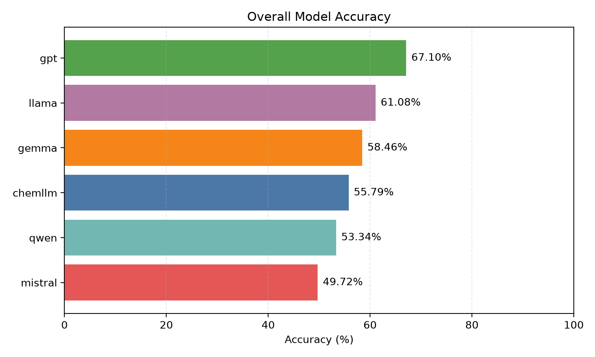
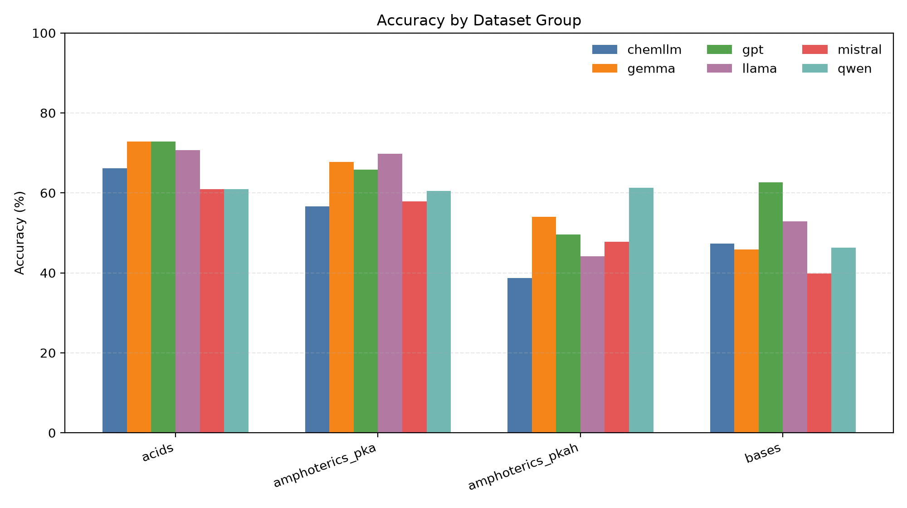
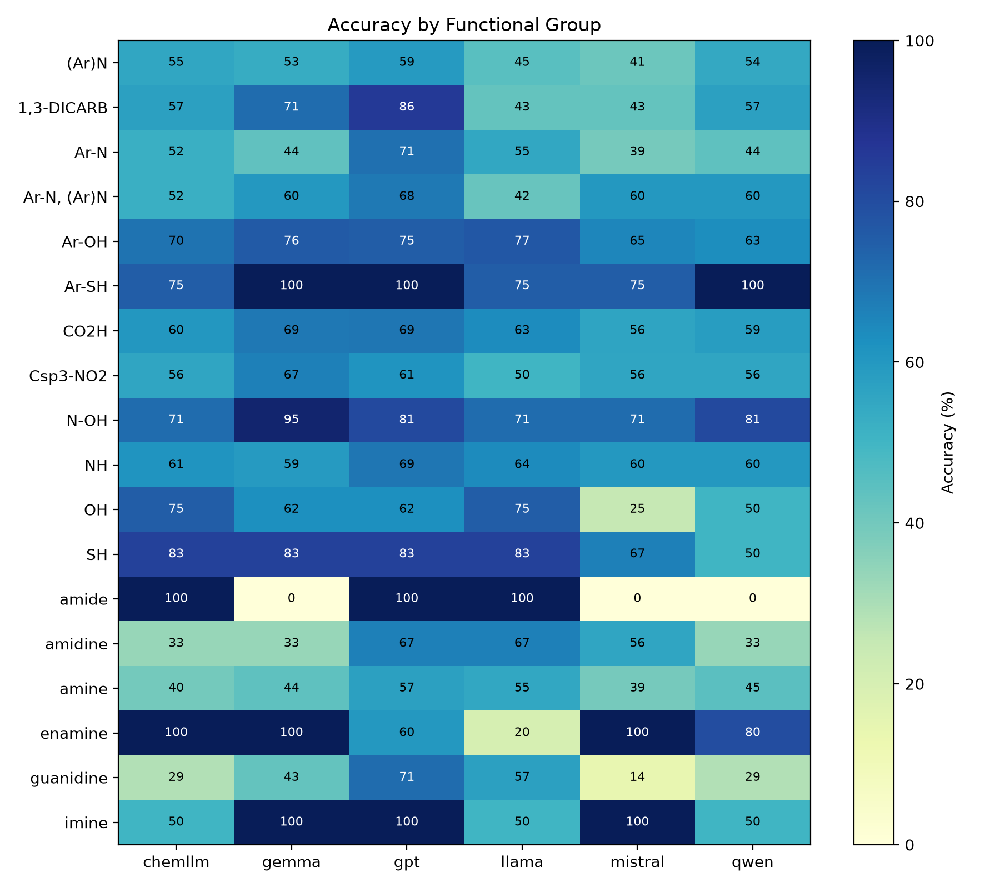

# ABSortQA

ABSortQA is a pairwise benchmark for acidic, basic, and amphoteric substance comparisons.

## Dataset Summary

| Result | Count |
|---|---:|
| Source IUPAC records | 24,939 |
| Generated pair comparisons | 81,632 |

| Dataset group | Pair count |
|---|---:|
| acids | 36,545 |
| bases | 42,443 |
| amphoterics_pka | 1,596 |
| amphoterics_pkah | 1,048 |
| TOTAL | 81,632 |

## Functional Group Counts


| Functional group | Pair count |
|---|---:|
| Ar-OH | 19,046 |
| CO2H | 18,507 |
| amine | 18,254 |
| Ar-N | 15,672 |
| (Ar)N | 7,781 |
| NH | 1,000 |
| Ar-N, (Ar)N | 497 |
| N-OH | 210 |
| Csp3-NO2 | 179 |
| amidine | 94 |
| OH | 77 |
| 1,3-DICARB | 70 |
| guanidine | 68 |
| SH | 63 |
| enamine | 47 |
| Ar-SH | 37 |
| imine | 23 |
| amide | 7 |

## Overall Model Accuracy



| Rank | Model | Accuracy |
|---:|---|---:|
| 1 | gpt | 67.10% (5476/8161) |
| 2 | llama | 61.08% (4985/8161) |
| 3 | gemma | 58.46% (4771/8161) |
| 4 | chemllm | 55.79% (4553/8161) |
| 5 | qwen | 53.34% (4353/8161) |
| 6 | mistral | 49.72% (4058/8161) |

## Accuracy by Dataset Group

Cells show accuracy as percent (correct/evaluated).



| Dataset group | chemllm | gemma | gpt | llama | mistral | qwen |
|---|---:|---:|---:|---:|---:|---:|
| acids | 66.17% (2418/3654) | 72.88% (2663/3654) | 72.88% (2663/3654) | 70.74% (2585/3654) | 60.89% (2225/3654) | 60.92% (2226/3654) |
| amphoterics_pka | 56.58% (86/152) | 67.76% (103/152) | 65.79% (100/152) | 69.74% (106/152) | 57.89% (88/152) | 60.53% (92/152) |
| amphoterics_pkah | 38.74% (43/111) | 54.05% (60/111) | 49.55% (55/111) | 44.14% (49/111) | 47.75% (53/111) | 61.26% (68/111) |
| bases | 47.27% (2006/4244) | 45.83% (1945/4244) | 62.63% (2658/4244) | 52.90% (2245/4244) | 39.87% (1692/4244) | 46.35% (1967/4244) |
| OVERALL | 55.79% (4553/8161) | 58.46% (4771/8161) | 67.10% (5476/8161) | 61.08% (4985/8161) | 49.72% (4058/8161) | 53.34% (4353/8161) |

## Accuracy by Functional Group

Cells show accuracy as percent (correct/evaluated).



| Functional group | chemllm | gemma | gpt | llama | mistral | qwen |
|---|---:|---:|---:|---:|---:|---:|
| (Ar)N | 55.14% (429/778) | 53.21% (414/778) | 59.00% (459/778) | 44.99% (350/778) | 41.13% (320/778) | 54.37% (423/778) |
| 1,3-DICARB | 57.14% (4/7) | 71.43% (5/7) | 85.71% (6/7) | 42.86% (3/7) | 42.86% (3/7) | 57.14% (4/7) |
| Ar-N | 52.14% (817/1567) | 43.65% (684/1567) | 70.64% (1107/1567) | 54.75% (858/1567) | 39.18% (614/1567) | 43.91% (688/1567) |
| Ar-N, (Ar)N | 52.00% (26/50) | 60.00% (30/50) | 68.00% (34/50) | 42.00% (21/50) | 60.00% (30/50) | 60.00% (30/50) |
| Ar-OH | 69.80% (1329/1904) | 76.05% (1448/1904) | 75.00% (1428/1904) | 76.79% (1462/1904) | 64.86% (1235/1904) | 63.13% (1202/1904) |
| Ar-SH | 75.00% (3/4) | 100.00% (4/4) | 100.00% (4/4) | 75.00% (3/4) | 75.00% (3/4) | 100.00% (4/4) |
| CO2H | 60.25% (1114/1849) | 68.58% (1268/1849) | 68.85% (1273/1849) | 63.44% (1173/1849) | 55.92% (1034/1849) | 58.52% (1082/1849) |
| Csp3-NO2 | 55.56% (10/18) | 66.67% (12/18) | 61.11% (11/18) | 50.00% (9/18) | 55.56% (10/18) | 55.56% (10/18) |
| N-OH | 71.43% (15/21) | 95.24% (20/21) | 80.95% (17/21) | 71.43% (15/21) | 71.43% (15/21) | 80.95% (17/21) |
| NH | 61.00% (61/100) | 59.00% (59/100) | 69.00% (69/100) | 64.00% (64/100) | 60.00% (60/100) | 60.00% (60/100) |
| OH | 75.00% (6/8) | 62.50% (5/8) | 62.50% (5/8) | 75.00% (6/8) | 25.00% (2/8) | 50.00% (4/8) |
| SH | 83.33% (5/6) | 83.33% (5/6) | 83.33% (5/6) | 83.33% (5/6) | 66.67% (4/6) | 50.00% (3/6) |
| amide | 100.00% (1/1) | 0.00% (0/1) | 100.00% (1/1) | 100.00% (1/1) | 0.00% (0/1) | 0.00% (0/1) |
| amidine | 33.33% (3/9) | 33.33% (3/9) | 66.67% (6/9) | 66.67% (6/9) | 55.56% (5/9) | 33.33% (3/9) |
| amine | 39.56% (722/1825) | 44.05% (804/1825) | 57.04% (1041/1825) | 54.96% (1003/1825) | 39.18% (715/1825) | 44.71% (816/1825) |
| enamine | 100.00% (5/5) | 100.00% (5/5) | 60.00% (3/5) | 20.00% (1/5) | 100.00% (5/5) | 80.00% (4/5) |
| guanidine | 28.57% (2/7) | 42.86% (3/7) | 71.43% (5/7) | 57.14% (4/7) | 14.29% (1/7) | 28.57% (2/7) |
| imine | 50.00% (1/2) | 100.00% (2/2) | 100.00% (2/2) | 50.00% (1/2) | 100.00% (2/2) | 50.00% (1/2) |

## Paper

For methodology, dataset construction, and experimental details, see our
[paper on IEEE Xplore](https://ieeexplore.ieee.org/document/11476267).

## Citation

If you use ABSortQA in your work, please cite:

```bibtex
@inproceedings{bui2026absortqa,
  title={ABSortQA: An Evaluation of Chemical Reasoning in Large Language Models Through Pairwise Comparison of Acid and Base Strength},
  author={Bui, Kien and Nguyen, Tien},
  booktitle={SoutheastCon 2026},
  year={2026},
  doi={10.1109/SoutheastCon63549.2026.11476267}
}
```
