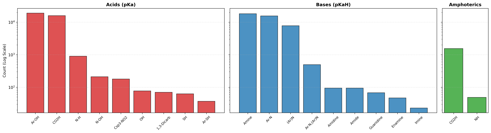

# ABSortQA

(To be updated)

This repository contains a curated dataset of **acidic, basic, and amphoteric substance pairs**.
Each pair includes SMILES representations, pKa / pKaH values, a reliability assessment, and the
priority functional group responsible for proton transfer.

---

## File Format

The dataset is stored as a single JSON object with four top-level keys:

- `acids` — valid acid–acid pairs  
- `bases` — valid base–base pairs  
- `amphoterics_pka` — amphoteric pairs compared using **pKa**  
- `amphoterics_pkah` — amphoteric pairs compared using **pKaH**

---

## Top-Level JSON Structure

```json
{
  "acids": [],
  "bases": [],
  "amphoterics_pka": [],
  "amphoterics_pkah": []
}
```
## Pair Object Schema

Each pair object represents a comparison between two substances and contains the following fields:

| Field | Type | Description |
|------|------|-------------|
| `SMILES1` | string | SMILES representation of substance 1 |
| `pka(h)_value1` | number | pKa or pKaH value of substance 1 |
| `assessment1` | integer | Reliability assessment of substance 1 |
| `SMILES2` | string | SMILES representation of substance 2 |
| `pka(h)_value2` | number | pKa or pKaH value of substance 2 |
| `assessment2` | integer | Reliability assessment of substance 2 |
| `functional_group` | string | Priority functional group shared by both substances |

---

## Reliability Assessment

The `assessment` field encodes the reliability of the reported pKa / pKaH value:

| Value | Label | Criterion |
|------|------|-----------|
| 1 | Reliable | ΔpKa(h) ≤ ±0.005 |
| 2 | Approximate | ΔpKa(h) ≤ ±0.04 |
| 3 | Uncertain | ΔpKa(h) > ±0.04 |

---

## Functional Group Codes

### Acid Functional Groups

| Description | Code |
|------------|------|
| Carboxylic acid (O–H) | `CO2H` |
| Phenol (Ar–O–H) | `Ar-OH` |
| Aliphatic alcohol (O–H) | `OH` |
| Thiophenol (Ar–S–H) | `Ar-SH` |
| Aliphatic thiol (S–H) | `SH` |
| N–O–H group | `N-OH` |
| N–H (nitrogen-bound hydrogen) | `N-H` |
| α-C–H between two carbonyl groups | `1,3-DICARB` |
| α-C–H adjacent to nitro group | `Csp3-NO2` |

---

### Base Functional Groups

| Description | Code |
|------------|------|
| Guanidine | `guanidine` |
| Amidine | `amidine` |
| Enamine | `enamine` |
| Imine | `imine` |
| Aliphatic amine (sp³ N) | `amine` |
| Aryl amine (aniline-like) | `Ar-N` |
| Aromatic nitrogen (pyridine-/imidazole-like) | `(Ar)N` |
| Amide | `amide` |


***Distribution of Functional Groups***

